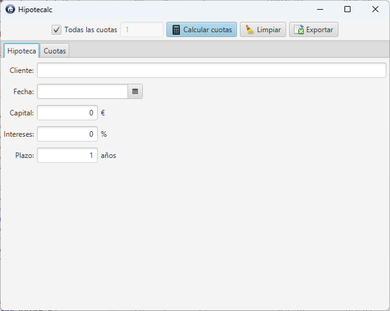
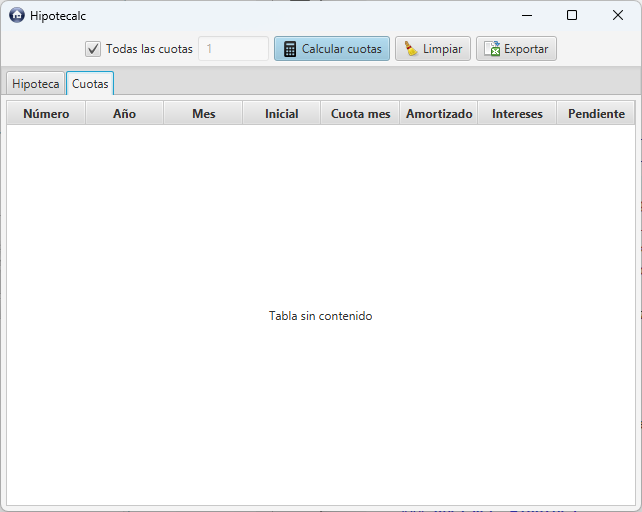
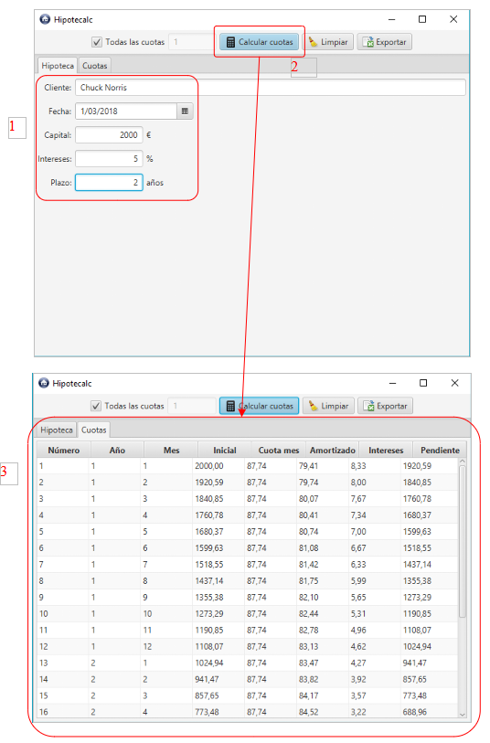
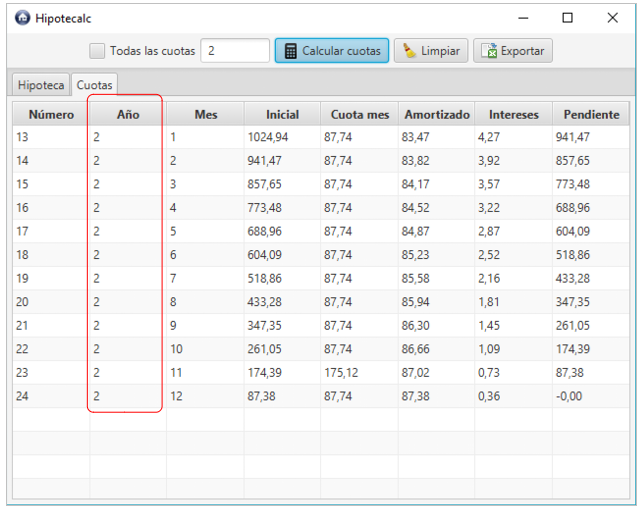
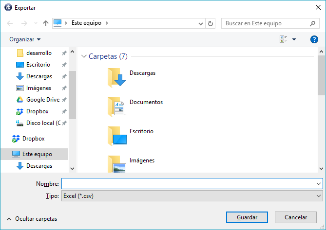
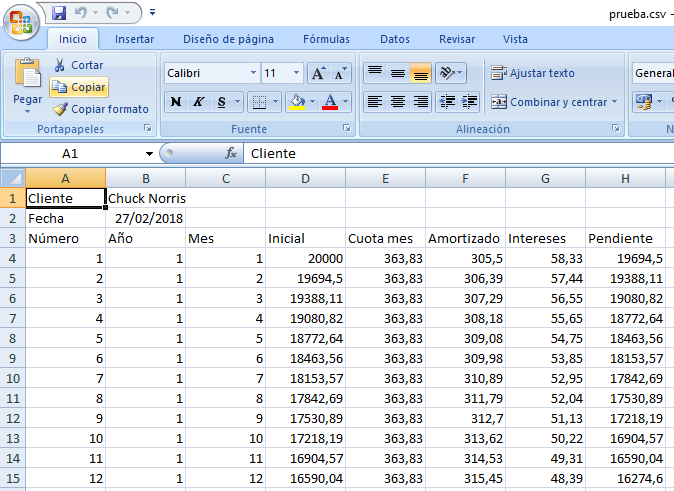

# HipoteCalc

## Descripción

Implementar una aplicación Java con interfaz gráfica empleando el framework JavaFX.

La aplicación **calculará todas las cuotas de un préstamo hipotecario** usando el sistema de amortización francés (el utilizado normalmente por los bancos), donde debemos indicar:

- nombre del cliente
- fecha del cálculo
- capital prestado por la entidad financiera para comprar la vivienda
- el porcentaje de interés aplicado al préstamo
- el número de años del préstamo

Se calcularán y presentarán al usuario todas las cuotas mensuales que debe pagar, así como la parte que corresponde a capital amortizado y qué parte son intereses de cada cuota.

También se podrá exportar los datos en formato **CSV (Comma Separated Values)**.

## Lógica de negocio

Se compone de dos clases:

- **Hipoteca** : es la clase principal, que debemos crear y a la que debemos pasarle los datos para que calcule las cuotas mensuales.
- **Cuota** : corresponde con una cuota mensual; la clase **Hipoteca** devuelve una lista de cuotas mensuales por todos los años del préstamo mediante su método `getCuotas()`. Es decir, si calculamos un préstamo a 30 años, devolverá *30x12= 360 cuotas*.

> Es necesario llamar al método `calcularCuotas` de la clase **Hipoteca** para que se calculen las cuotas y se almacenen en la propiedad "cuotas" de la misma.

Las clases se encuentran en el paquete `dad.hipotecalc.model` dentro del proyecto  **HipoteCalc** provisto por el profesor.

En el paquete `dad.hipotecalc` del proyecto se encuentra la clase `Main` con el siguiente ejemplo de uso:

```java
public class Main {

    public static void main(String[] args) {

        // EJEMPLO DE CÁLCULO DE HIPOTECA POR UN CAPITAL DE 20.000€, A UN INTERÉS DEL 3.5% Y CON UNA DURACIÓN 5 AÑOS

        Hipoteca hipoteca = new Hipoteca();
        hipoteca.setCliente("Chuck Norris");    // nombre del cliente
        hipoteca.setFecha(LocalDate.now());        // fecha del cálculo
        hipoteca.setCapital(20000);                // importe del préstamo
        hipoteca.setIntereses(3.5);                // porcentaje de interés aplicado
        hipoteca.setPlazo(5);                    // duración del préstamo en años  

        // TODAS LAS CUOTAS (5 AÑOS = 5 * 12 = 60 CUOTAS)
        hipoteca.calcularCuotas();
        System.out.println(
            "Número" + "\t" + "Año" + "\t" + "Mes" + "\t" + "Capital inicial" + "\t" + 
            "Cuota mensual" + "\t" + "Capital amortizado" + "\t" + 
            "Intereses" + "\t" + "Capital pendiente");
        for (Cuota cuota : hipoteca.getCuotas()) {
            System.out.println(cuota);
        }

        // SOLO LAS DEL 3ER AÑO (POR EJEMPLO)
        hipoteca.calcularCuotas(3);
        System.out.println(
            "Número" + "\t" + "Año" + "\t" + "Mes" + "\t" + "Capital inicial" + "\t" + 
            "Cuota mensual" + "\t" + "Capital amortizado" + "\t" + 
            "Intereses" + "\t" + "Capital pendiente");
        for (Cuota cuota : hipoteca.getCuotas()) {
            System.out.println(cuota);
        }

    }

}
```

El ejemplo anterior devolverá algo como lo siguiente:

```
Número    Año    Mes    Capital inicial    Cuota mensual    Capital amortizado    Intereses    Capital pendiente
     1      1      1           20000,00           363,83                305,50        58,33             19694,50
     2      1      2           19694,50           363,83                306,39        57,44             19388,11
     3      1      3           19388,11           363,83                307,29        56,55             19080,82
     4      1      4           19080,82           363,83                308,18        55,65             18772,64
     5      1      5           18772,64           363,83                309,08        54,75             18463,56
     6      1      6           18463,56           363,83                309,98        53,85             18153,57
     7      1      7           18153,57           363,83                310,89        52,95             17842,69
     8      1      8           17842,69           363,83                311,79        52,04             17530,89
     9      1      9           17530,89           363,83                312,70        51,13             17218,19
    10      1     10           17218,19           363,83                313,62        50,22             16904,57
    11      1     11           16904,57           363,83                314,53        49,31             16590,04
    12      1     12           16590,04           363,83                315,45        48,39             16274,60
    13      2      1           16274,60           363,83                316,37        47,47             15958,23
    14      2      2           15958,23           363,83                317,29        46,54             15640,94
    15      2      3           15640,94           363,83                318,22        45,62             15322,72
    16      2      4           15322,72           363,83                319,14        44,69             15003,58
    17      2      5           15003,58           363,83                320,07        43,76             14683,51
    18      2      6           14683,51           363,83                321,01        42,83             14362,50
    19      2      7           14362,50           363,83                321,94        41,89             14040,55
    20      2      8           14040,55           363,83                322,88        40,95             13717,67
    21      2      9           13717,67           363,83                323,83        40,01             13393,85
[...]
```

## Iconos

Se dispone de los siguientes iconos en `resources/images`:

| Calcular                                     | Limpiar                                       | Exportar                                      | Logo de la aplicación                        |
| -------------------------------------------- | --------------------------------------------- | --------------------------------------------- | -------------------------------------------- |
|  |  |  |  |
| *calc16x16.png*                              | *clear16x16.png*                              | *excel16x16.png*                              | *logo32x32.png*                              |

## Ventana principal

La aplicación contará con una única ventana, que se abrirá al iniciar la aplicación. Ésta contará con dos pestañas y una barra de herramientas en la parte superior.

### Pestaña "Hipoteca"

Desde esta pestaña se introducirán los datos del cliente y de la hipoteca.



### Pestaña "Cuotas"

En esta pestaña veremos las cuotas calculadas.



### El botón "Calcular cuotas"

- Calculará las cuotas mediante la clase **Hipoteca** y se mostrarán las cuotas en la tabla de la pestaña **Cuotas**.

- Será obligatorio especificar **Capital**, **Intereses** y **Años** en la pestaña **Hipoteca**.
  
  - Deberá mostrarse un diálogo de aviso al usuario en caso contrario.

- Será el botón por defecto.

- Automáticamente se cambiará a la pestaña cuotas.
  
  

#### Filtro de cuotas

A la izquierda del botón **Calcular cuotas** disponemos de un filtro de cuotas.

- Si la casilla **Todas las cuotas** está seleccionada, se calcularán todas las cuotas (para ello hay que llamar al método `calcularCuotas()` de la Hipoteca sin parámetros).
  
  

- **En caso contrario**, se habilitará el cuadro de texto y se podrá introducir el año del que queremos que se muestren las cuotas (para ello se llamará al método `calcularCuotas(año)` de la **Hipoteca** pasándole un número entero con el año.
  
  
  
  El método `calcularCuotas(año)` lanzará una **excepción** si se indica un año fuera del rango de la hipoteca. **Debemos capturarla y mostrar un diálogo con el error al usuario**.

Por ejemplo, si indicamos el segundo año de la hipoteca y calculamos, saldría algo así:



### El botón "Limpiar"

- Restablecerá todos los campos de la aplicación y vaciará la tabla de cuotas.
- Para ello simplemente deberá llamarse al método `limpiar()` de la hipoteca.

### El botón "Exportar"

- Exportará en formato **CSV** las cuotas generadas así como la fecha y el nombre del cliente.

- Se mostrará un diálogo de guardar con el título **Exportar**.
  
  
  
  El diálogo deberá tener los filtro "Excel (\*.csv)" y "Todos los archivos (\*.\*)".

- Si se pulsa **Cancelar** no se hará nada.

- Si se pulsa **Guardar** se deberá generar el fichero en formato CSV (utilizando `;` como separador), que luego podrá importarse en Excel, conteniendo:
  
  - <u>Primera línea</u>: Nombre del cliente en la primera línea del fichero
  
  - <u>Segunda línea</u>: Fecha del cálculo
  
  - <u>Tercera línea</u>: Títulos de los campos que siguen a continuación.
  
  - <u>Resto de líneas</u>: Datos de todas las cuotas de la hipoteca calculada.

Por ejemplo:

```csv
Cliente;Chuck Norris
Fecha;2018-02-27
Número;Año;Mes;Inicial;Cuota mes;Amortizado;Intereses;Pendiente
1;1;1;20000,00;363,83;305,50;58,33;19694,50
2;1;2;19694,50;363,83;306,39;57,44;19388,11
3;1;3;19388,11;363,83;307,29;56,55;19080,82
4;1;4;19080,82;363,83;308,18;55,65;18772,64
5;1;5;18772,64;363,83;309,08;54,75;18463,56
6;1;6;18463,56;363,83;309,98;53,85;18153,57
7;1;7;18153,57;363,83;310,89;52,95;17842,69
8;1;8;17842,69;363,83;311,79;52,04;17530,89
9;1;9;17530,89;363,83;312,70;51,13;17218,19
10;1;10;17218,19;363,83;313,62;50,22;16904,57
11;1;11;16904,57;363,83;314,53;49,31;16590,04
12;1;12;16590,04;363,83;315,45;48,39;16274,60
[...]
```

De forma que si lo abrimos con Excel quedaría de la siguiente forma:



## Criterios de calificación

| **Criterios**                                                               | **Puntuación** |
| --------------------------------------------------------------------------- | -------------- |
| Ventana principal > Diseño/Aspecto                                          | 6              |
| Pestaña Hipoteca > Diseño/Aspecto                                           | 10             |
| Pestaña Contactos > Diseño/Aspecto                                          | 6              |
| Barra de herramientas > Diseño (centrado, márgenes, botón por defecto, ...) | 6              |
| Barra de herramientas > Calcular cuotas                                     | 15             |
| Barra de herramientas > Calcular cuotas > Validar campos                    | 7              |
| Barra de herramientas > Calcular cuotas > Cambiar pestaña                   | 6              |
| Barra de herramientas > Filtrado cuotas                                     | 15             |
| Barra de herramientas > Filtrado cuotas > Control errores                   | 5              |
| Barra de herramientas > Limpiar                                             | 10             |
| Barra de herramientas > Exportar CSV                                        | 15             |
| **Total**                                                                   | 100            |

> El profesor determinará el grado de cumplimiento de cada apartado a partir de la ejecución de la aplicación, por lo que es sumamente importante que los apartados que queremos que puntúen se puedan probar.
